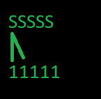
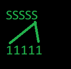
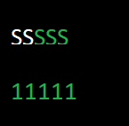

# Dinner of the Sages

## Introduction

A lot of famous thimkers and philosophers such as Socrates or Plato gathered around a table to have a lunch and share their thought. However, there is only one chopstick per thinker, and you need two in order to eat.

### Objective

The goal was to create a program that emulate the sages states and hunger, and to make them choose their chopstick by using multithreading.

## Overview

## States
-----------
Different states of the sages:  
- `S` means they are thinking for 1 to 3 seconds
- `M`  means they are eating for 1 to 3 seconds
- `C` means that the sage has no access to two chopstick, and is waiting to eat
- `F` means that the sage finished eating
- `1` means that the chopstick is available
- `0` means that the chopstick is not available

## Behavior

A sage can only take the chopstick in front of him, or next to him.

The last sage can only take the first chopstick, or the one in front of him

The color of the sages changes according to their hunger. If they are white, it means they are full.
A day passes once every sage is full, and the program is over once 7 days have passed.

You can change the number of sages in the program, with the minimum and maximum random time too.
